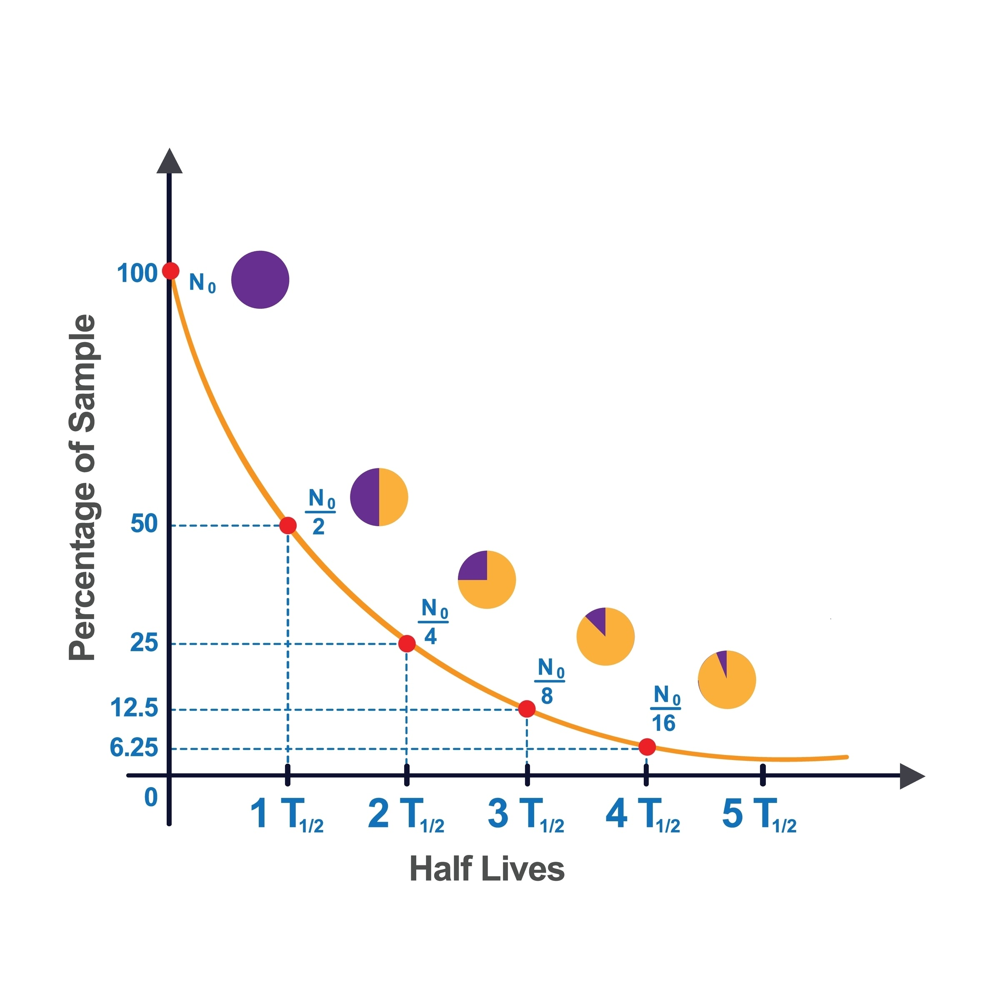

# Atomize - Design Document

## Overview

Atomize is a habit-tracking application that uses principles of atomic decay and half-lives as a metaphor for habit formation, maintenance, and degradation. The app helps users build and maintain habits by visualizing their consistency through radioactive decay mechanics.

## Core Concept

### Half-Life Mechanism

The application uses the concept of **half-lives** to track habit strength. Just as radioactive materials decay over time, habits in Atomize decay when not practiced, and grow stronger when consistently performed.



As shown in the diagram above, habit strength follows an exponential decay curve when not maintained:
- **NÄ** represents the initial habit strength (100%)
- After **1 half-life (TÅ/Ç)**: Habit strength drops to 50%
- After **2 half-lives**: Habit strength drops to 25%
- After **3 half-lives**: Habit strength drops to 12.5%
- After **4 half-lives**: Habit strength drops to 6.25%
- And so on...

The pie charts illustrate the remaining active portion (purple) versus the decayed portion (orange/yellow) of the habit at each half-life interval.

## Key Features

### 1. Habit Creation
- Users can create custom habits with personalized half-life periods
- Define the frequency of habit performance (daily, weekly, custom intervals)
- Set custom decay rates based on habit difficulty and personal goals

### 2. Habit Strength Visualization
- Real-time visual representation of habit strength using decay curves
- Color-coded indicators showing habit health
- Pie chart views showing active vs. decayed portions
- Timeline views showing habit consistency over time

### 3. Half-Life Configuration
- Customizable half-life periods per habit
- Shorter half-lives for habits requiring daily attention
- Longer half-lives for habits with more flexibility
- Dynamic adjustment based on user performance

### 4. Decay Prevention
- Notifications and reminders before significant decay occurs
- Streak tracking to maintain habit strength
- Recovery mechanisms to rebuild decayed habits

### 5. Progress Tracking
- Historical data showing habit strength over time
- Statistics on consistency and recovery patterns
- Achievement system based on maintaining high habit strength

## Technical Architecture

### Data Model

#### Habit
```dart
class Habit {
  String id;
  String name;
  String description;
  DateTime createdAt;
  Duration halfLife;          // Time period for 50% decay
  double currentStrength;     // Current strength (0-100%)
  DateTime lastPerformed;
  int streak;
  List<HabitLog> logs;
}
```

#### HabitLog
```dart
class HabitLog {
  String id;
  String habitId;
  DateTime timestamp;
  double strengthBefore;
  double strengthAfter;
  bool wasPerformed;
}
```

### Calculations

#### Decay Formula
The habit strength follows exponential decay:

```
N(t) = NÄ ◊ (1/2)^(t/TÅ/Ç)

Where:
- N(t) = Current strength at time t
- NÄ = Initial strength (100% or previous value)
- t = Time elapsed since last performance
- TÅ/Ç = Half-life period
```

#### Strength Recovery
When a habit is performed, strength increases based on:
- Current strength level
- Consistency of recent performance
- Configured growth rate

```
New Strength = min(100%, Current Strength + Recovery Boost)
Recovery Boost = Base Boost ◊ Streak Multiplier
```

## User Experience Flow

### 1. Onboarding
- Introduction to the half-life concept
- Tutorial showing how habits decay and recover
- Sample habit creation with guided configuration

### 2. Daily Interaction
- Dashboard showing all habits with current strength
- Quick-check interface to mark habits as completed
- Visual decay warnings for at-risk habits

### 3. Long-term Engagement
- Weekly/monthly reports on habit health
- Insights into decay patterns and optimal half-life periods
- Recommendations for habit adjustments

## Visual Design

### Color Scheme
- **Purple**: Active/healthy habit strength
- **Orange/Yellow**: Decayed portion
- **Gradient**: Transition states during decay
- **Red**: Critical decay warnings
- **Green**: Strong habits and achievements

### UI Components
- Decay curve graphs (similar to reference image)
- Pie charts for at-a-glance habit health
- Timeline views for historical tracking
- Card-based habit list with strength indicators

## Future Enhancements

### Phase 2 Features
- Social features (accountability partners)
- Habit dependencies and chains
- Custom decay curve shapes
- Integration with other tracking apps
- Gamification elements (nuclear-themed achievements)

### Phase 3 Features
- AI-powered half-life recommendations
- Predictive analytics for habit success
- Community challenges
- Export and data portability

## Technical Stack

### Frontend
- **Framework**: Flutter
- **State Management**: Riverpod/Provider
- **Local Storage**: Hive/SQLite
- **Charts**: fl_chart or syncfusion_flutter_charts

### Backend (Future)
- **API**: Firebase/Supabase
- **Authentication**: Firebase Auth
- **Cloud Storage**: Firestore/Supabase DB
- **Analytics**: Firebase Analytics

## Success Metrics

- User retention rates
- Average habit strength across users
- Number of habits maintained above 50% strength
- User engagement frequency
- Recovery rates from decayed habits

## Implementation Roadmap

### MVP (Minimum Viable Product)
1. Habit creation and configuration
2. Basic decay calculation and visualization
3. Manual habit check-ins
4. Simple strength indicators
5. Local data persistence

### V1.0
1. Advanced visualizations (graphs, charts)
2. Notifications and reminders
3. Streak tracking
4. Historical data views
5. Theme customization

### V2.0
1. Cloud sync
2. Social features
3. Advanced analytics
4. AI recommendations
5. Cross-platform support

## Design Principles

1. **Simplicity**: Make habit tracking effortless
2. **Visual Clarity**: Use decay visualization to drive understanding
3. **Scientific Grounding**: Base mechanics on real radioactive decay
4. **Motivation**: Gamify without overwhelming
5. **Flexibility**: Allow users to customize their experience

---

**Document Version**: 1.0
**Last Updated**: 2025-11-23
**Status**: Initial Draft
